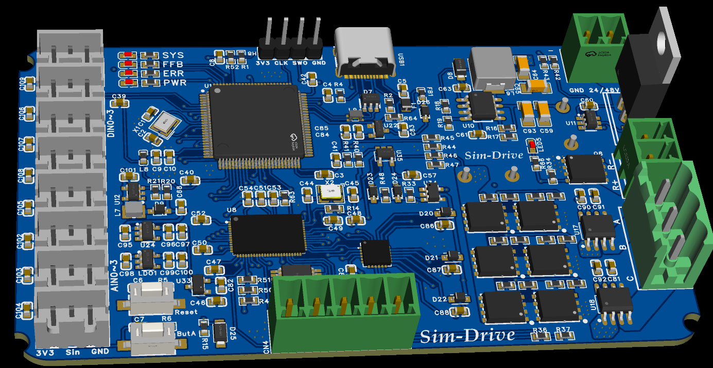
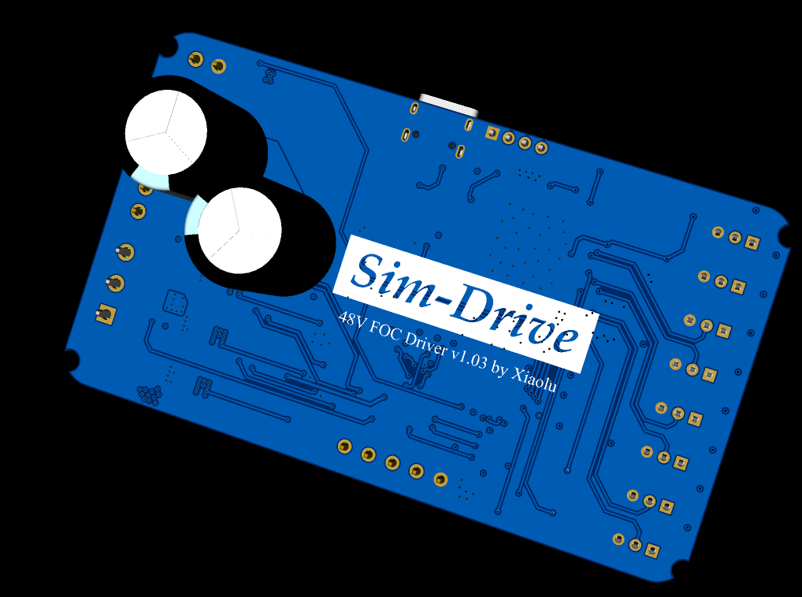
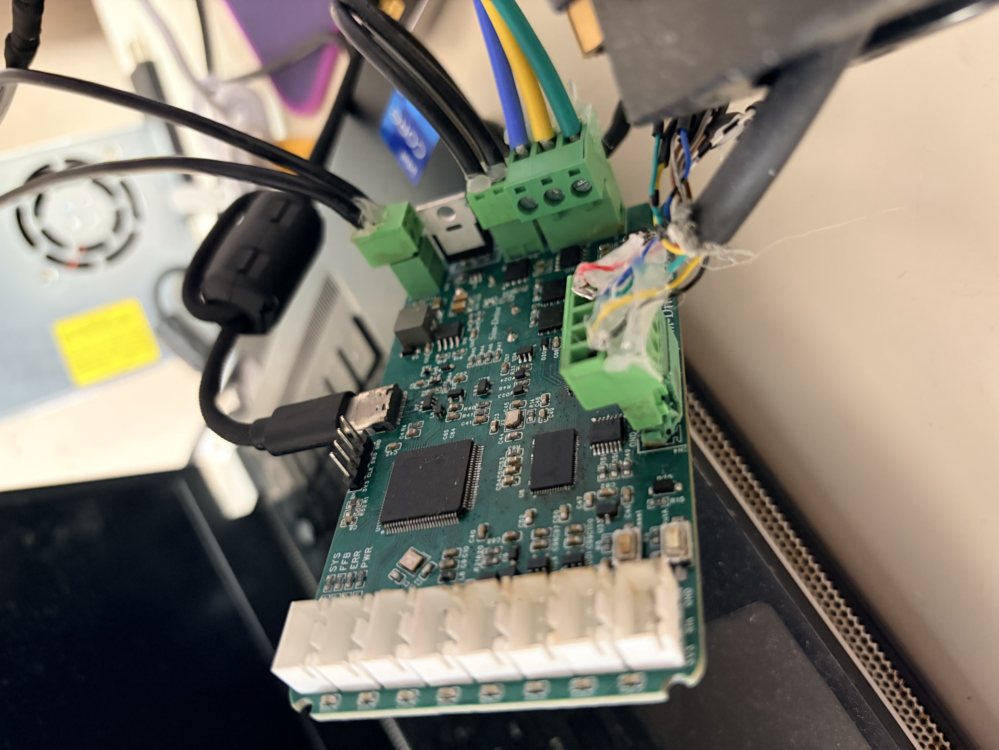
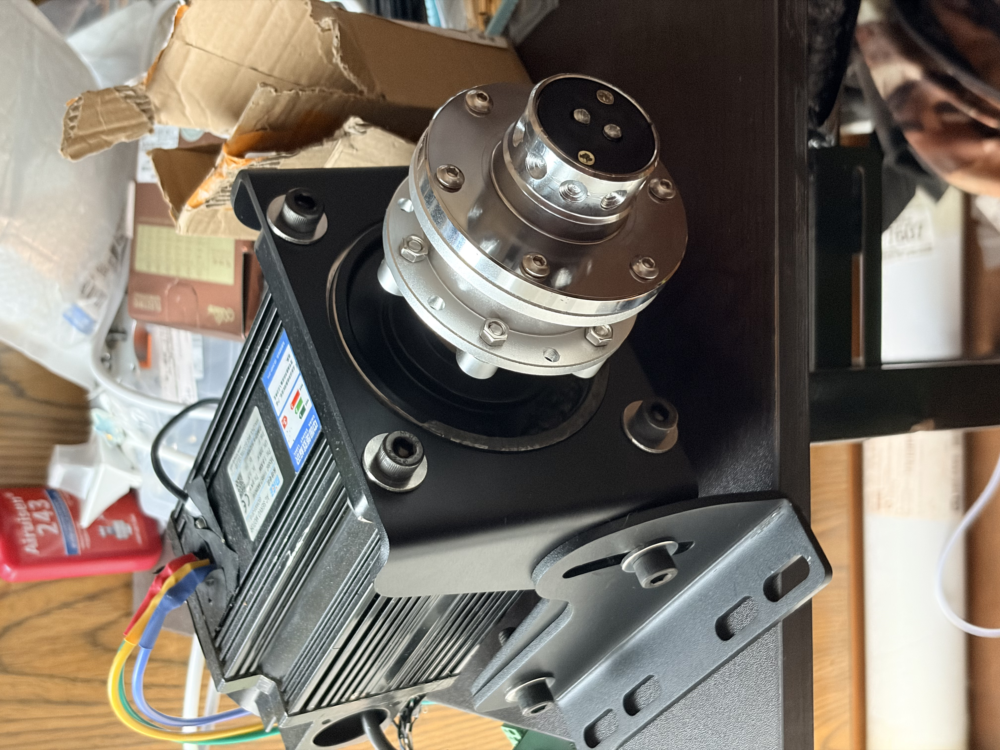
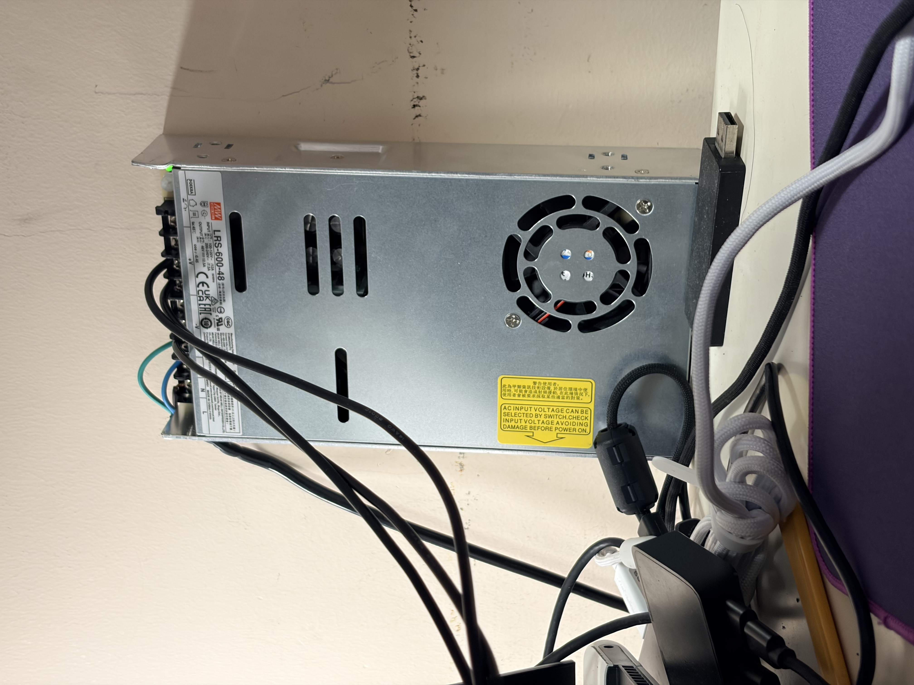

# 🏎️ Sim-Drive: High-Fidelity FOC Direct Drive Wheel Controller

## 📖 项目简介 (Project Overview)

**Sim-Drive** 是一套专为硬核模拟赛车（Sim Racing）量身打造的高保真、大扭矩直驱力回馈控制器系统。包含深度定制的 FOC 驱动主板、伺服电机选型策略以及高刚性机械连接方案。

本项目基于德国开发者 UltraWipf 的优秀开源项目 [OpenFFBoard](https://github.com/Ultrawipf/OpenFFBoard) 进行深度重构与改进。专为 **130ST / 110ST 等大扭矩工业伺服电机** 优化，打造了一款极具工业级鲁棒性（Robustness）的机电软硬一体化解决方案。



---

## ⚡ 相比原版 OpenFFB 的核心进化 (Key Improvements vs. Original)

原版 OpenFFB 采用了“STM32 开发板 + 驱动扩展板”的分体堆叠架构，体积庞大且在极端工况下存在接口抗震性短板。本主板对其进行了**重度集成与工程化改造**：

1. **All-in-One 高集成度重构**：将原本分体的两块控制板融为一体。大幅缩小 PCB 体积，消除板间插针连接带来的接触电阻和寄生电感。
2. **去除冗余通道，专注伺服**：原版设计保留了对两相步进电机的支持。本板果断砍掉多余的第 4 条半桥通道，将布线资源和散热面积 100% 倾斜给 3 相 BLDC/PMSM 伺服电机。
3. **接口现代化与系统安全**：
   * 采用 **USB Type-C** 接口，并加入了原版缺失的 **USB 共模滤波 (Common Mode Choke) 与磁珠隔离**，根除大功率 PWM 切换导致的地弹掉线问题。
   * 集成 50W/100W 外置刹车电阻的**硬件级过压斩波器（Brake Chopper）**，并引入理想二极管防反接与隔离式电流采样，提供工业级安全防护。

---

## 🛠️ 深度硬件架构设计 (Detailed Hardware Architecture)

本板的设计拒绝任何“凑合能用”的妥协，在 EMC（电磁兼容）、PI（电源完整性）和 SI（信号完整性）上进行了极细致的推敲：

### 1. 极致的电源与安全冗余 (Power & Safety Redundancy)

* **0 压降防反接保护**：采用 `LM74700` 理想二极管控制器配合 `IRFB4110` (100V/120A) 大功率 MOS 管。即使在误接 48V 电源时也能瞬间关断保护后级，且正常工作时几乎无发热损耗。
* **高耐压 4 级电源树 (Power Tree)**：
  * **主降压**：采用 `MAX5035` 开关电源芯片（耐压高达 76V）将 48V 降至 5V，无惧电机抛负载（Load Dump）产生的电压尖峰。
  * **升压驱动**：通过 `AP3012` Boost 电路将 5V 升压至 12V-15V，专为栅极驱动器提供强劲的开启电压。
  * **数模隔离供电**：5V 降 3.3V 时，采用了**双 LDO 冗余架构**。`ME6211` 专供 STM32 数字逻辑，`SPX5205` 专供 ACS724 及运放的模拟参考端，从物理层面隔绝了数字高频噪声对 ADC 采样的污染。
* **独立硬件级过压刹车**：使用 `LMV321` 搭配 `SL27517` 驱动器，通过精密电阻分压，将**硬件强制刹车阈值精准卡在 63.7V**。当电机反电动势越过红线，无需 MCU 软件干预，硬件自动导通大功率 MOS 管，将能量泄放至外接的 50W/100W 黄金铝壳电阻，绝对保障母线电容不被击穿。

### 2. 驱动与电气隔离设计 (Drive & Galvanic Isolation)

* **分立式驱动架构**：采用 `TMC4671-LA` 硬件 FOC 协处理器，搭配 `FD6288Q` 三相栅极驱动器与 `WSD75100` (75V/100A) 功率 MOS 管。相比于高集成芯片，分立式设计分散了热源，提高了极端大扭矩工况下的热稳定性。
* **磁隔离电流采样**：摒弃了原版的电阻压降采样（Shunt），升级为 `ACS724-30AB` **霍尔效应电流传感器**。彻底实现了 48V 强电动力与 3.3V 弱电逻辑的**电气隔离 (Galvanic Isolation)**，杜绝了功率管击穿导致 MCU 连带烧毁的灾难。

### 3. EMC 专项抗干扰加固 (EMC & Ground Bounce Mitigation)

模拟赛车大功率 PWM 切换会产生严重的地弹（Ground Bounce）和共模干扰。本板在设计上打上了重重“补丁”：

* **USB 差分链路滤波**：在 Type-C 接口的 ESD 保护矩阵之后，针对性串联了 **`ACM2012-900-2P` 共模电感**。对有用的差分数据呈现 0Ω 阻抗，而对高频共模噪声提供 900Ω 的巨大阻抗墙，彻底根除高频脉冲导致的 USB 断联假死。
* **VBUS 射频净化**：在 USB 电源入口处串联高频磁珠（600Ω @ 100MHz），吸收线缆上的射频干扰。
* **编码器信号整形**：针对长线传输，在 5V TTL 编码器接口端加入了 `74LCX07` 缓冲器进行电平转换与施密特整形，确保 TMC4671 读取到的 A/B/Z 脉冲边沿陡峭且无毛刺。

### 4. PCB 布局与布线规范 (PCB Layout Rules)

* **叠层与阻抗控制**：严格采用 **4 层板 (Top-GND-Power-Bottom)** 结构。指定 `JLC04161H-7628` 压合参数，完美契合 8mil 线宽的 USB 差分对 **90Ω 阻抗匹配**。
* **完整地平面策略**：采用**统一地平面 (Solid Ground Plane)** 配合 **“逻辑分区布局”**（右侧高压动力区，左侧低压逻辑区）。避免了“切地”带来的跨分割大环形天线辐射。
* **大电流覆铜与散热**：在 DFN5x6 MOS 管区域进行大面积覆铜，并密布散热过孔 (Thermal Vias)，利用 PCB 铜皮作为天然散热器，使其在 15A 瞬态电流下即可维持被动散热。





---

## 🚀 动力与传感系统选型 (Motor & Encoder Specifications)

本系统采用工业级交流伺服电机作为动力源，综合转动惯量与扭矩表现，选定 **110ST-M06030** 作为基准测试平台。

### 1. 伺服电机参数 (Servo Motor: 110ST-M06030)

* **额定/峰值扭矩**：6 N·m / ~18 N·m（配合 48V/15A 系统可爆发极强的瞬态动态响应）。
* **力矩系数 (Torque Constant)**：**1.0 N·m/A**（此处的 A 为总输入电流，可近似理解为同等总功率下的扭矩转化率）。
* **转动惯量 (Rotor Inertia)**：**7.6 kg/m² (* 10^-4)**。该惯量提供了模拟赛车所需的“真实机械阻尼感”，自带良好的物理低通滤波效应，手感厚重而不失细节。

### 2. 编码器接口定义 (Encoder: Tamagawa OIH 48-2500P8)

电机自带多摩川 (Tamagawa) 2500 线光电编码器（在 OpenFFB 固件中 CPR 配置为 10000）。通过主板板载的 `74LCX07` 缓冲器进行 5V 至 3.3V 的电平转换与施密特整形。

**物理接线线序（直连主板 5Pin 端子）：**

* 🟥 **红 (Red)**: `5V`（供电）
* 🟨 **黄 (Yellow)**: `Z`（Index 零位脉冲）
* 🟦 **蓝 (Blue)**: `B`（B 相脉冲）
* 🟩 **绿 (Green)**: `A`（A 相脉冲）
* ⬛ **黑 (Black)**: `G`（GND 地）

*(注：若电机原厂引出差分负极信号线 A-/B-/Z-，在单端接法下请做好绝缘包扎，悬空处理即可)*



---

## ⚙️ 机械结构设计 (Mechanical Design)

本项目的机械部分专为 **110ST 系列工业伺服电机** 设计。为了确保在高频大扭矩力回馈（FFB）下无结构形变、无共振、无虚位，核心连接件均采用 **工业级标准件 + 定制 CNC/厚板钣金** 的组合方案。

### 1. 核心动力连接：涨紧套 (Expansion Sleeve)

本项目摒弃了传统的键槽连接或顶丝连接，采用工业级双锥面涨紧套，实现真正的 360° 无间隙（Zero Backlash）硬核锁死。

* **选用型号**：**Z21-19x35**（或同规格 Z2 型）。
* **适配参数**：内径 19mm（适配 110ST 标准电机轴），外径 35mm。
* **装配逻辑**：定制的 CNC 法兰盘直接替代涨紧套的原装前压环。螺丝穿过法兰盘直接锁入涨紧套主体，实现法兰与电机轴的一体化。

### 2. 定制法兰盘 (Custom CNC Flange)

法兰盘是连接电机轴与快拆/方向盘的核心媒介，要求极高的同心度与刚性。

* **加工工艺**：**8.0mm 厚度，铝合金 6061-T6**，CNC 加工，表面喷砂氧化黑。
* **核心尺寸设计**：
  * **中心定位孔 (19.1mm)**：电机 19mm 轴刚好穿过此孔，利用电机轴做物理极限定心，同心度极高。
  * **涨紧套适配槽 (内向腰型孔)**：由于市面 Z21 涨紧套的螺丝分布圆直径（BCD）在 26mm~28mm 之间浮动，本设计采用了 **槽宽 6.2mm、内边缘距中心孔 1.5mm** 的高容错腰型槽设计，完美兼容各厂牌公差。
  * **外圈快拆孔 (70mm PCD)**：标准 6 × M5 通孔，完美适配市面 99% 的赛车快拆（如 D1 Spec、NRG 等）。

### 3. 可调式电机支架 (Adjustable Motor Mount)

为承受 18N·m 的瞬态冲击，支架放弃了通用型的大开槽设计，采用 **110ST 专用孔位 + 分体式扇形调节** 结构。

* **加工工艺**：**4.0mm 厚度，SPCC (碳钢/冷轧板)**，激光切割 + 冲压折弯，表面 **喷塑（粉末喷涂）哑光黑**。
* **结构特点**：
  * **前面板 (Motor Plate)**：中心 95.2mm 避让孔，完美嵌合 110 电机止口；4 × 9mm 圆孔（90x90mm 间距）死死锁住电机法兰。
  * **侧支撑板 (Side Brackets)**：左右分体 L 型设计，底部具有 **20mm 加宽折弯边**，方便桌面 C 形夹或铝型材固定。
  * **无极角度调节**：侧板上方配有 **8.3mm 弧形滑轨槽**，配合下方 8mm 支点孔，实现电机仰角的平滑调节。

### 🛒 机械五金件 BOM 表 (Hardware BOM)

> ⚠️ **强烈警告**：直驱系统震动剧烈，所有受力螺丝**必须使用 12.9 级高强度合金钢材质**，所有螺母**必须使用带尼龙圈的防松螺母**，绝不可用普通 304 不锈钢螺丝替代！

| 部位 | 规格说明 | 数量 | 备注 |
| :--- | :--- | :--- | :--- |
| **法兰 ↔ 涨紧套** | M4 × 30mm 圆柱头内六角 (12.9级) | 4 颗 | 长度需穿透 8mm 法兰并吃满涨紧套螺纹 |
| **法兰 ↔ 涨紧套** | M4 加大平垫片 (外径 12mm 左右) | 4 片 | **必备**。用于完美覆盖 6.2mm 腰型槽，分散压紧力 |
| **方向盘 ↔ 快拆 ↔ 法兰** | M5 × 30mm 沉头内六角 (12.9级) | 6 颗 | 长度视个人 Hub 外壳厚度而定 |
| **电机 ↔ 支架前面板** | M8 × 20mm 圆柱头内六角 (12.9级) | 4 颗 | 从法兰侧向电机侧对穿锁紧 |
| **支架前面板 ↔ 侧支撑** | M8 × 25mm 圆柱头内六角 (12.9级) | 4 颗 | 用于转轴和弧形滑轨的连接锁定 |
| **支架全局锁紧** | M8 尼龙防松螺母 | 8 颗 | 配合上述所有 M8 螺丝使用 |
| **支架全局锁紧** | M8 加大平垫片 (外径 20mm-24mm) | 12 片 | 保护喷塑漆面，压紧 8.3mm 弧形槽 |

### 🛠️ 装配特别注意事项 (Assembly Notes)

1. **法兰盘螺丝锁紧顺序**：在锁紧 Z21 涨紧套的 4 颗 M4 螺丝时，务必采用 **“交叉对角线”** 方式（1-3-2-4 顺序），每次仅推进 1/4 圈。由于采用了 19.1mm 中心孔套轴定心，只要均匀上紧，法兰盘即可达到极其完美的端面垂直度。
2. **螺纹胶的使用**：强烈建议在快拆连接的 M5 螺丝、以及部分不易拆卸部位涂抹少量 **243 蓝色螺纹胶**（可拆卸型），以抵御长期的高频 FFB 震动。
3. **支架组装公差**：由于 4mm SPCC 喷塑后会增加约 0.15mm 的双边漆厚，前面板塞入两侧支撑板时可能会略紧。这是预留的刚性过盈设计，利用 M8 螺丝和加大垫片强行夹紧后，整个支架将坚如磐石。

---

## 🔌 电子架构与外设接口 (Electronic Architecture & Interfaces)

* **PCB 叠层设计**：严格采用 4 层板 (Top-GND-Power-Bottom) 结构。指定 `JLC04161H-7628` 压合参数，契合 8mil 线宽的 USB 差分对 90Ω 阻抗匹配要求。
* **CN1 (Power)**: 48V DC 输入（推荐匹配明纬 LRS-600-48 电源）。
* **CN3 (Motor)**: U, V, W 三相动力输出。
* **CN5 (Brake)**: 泄放电阻接口（务必外接 50W 10Ω 铝壳电阻）。
* **CN4 (Encoder)**: 5Pin 接口（5V, GND, A, B, Z），适配工业伺服电机光电编码器。
* **DIN/AIN (Expansion)**: 预留多路数字/模拟通道，用于后期扩展方向盘拨片、按钮 Hub。



---

## 🐛 已知硬件勘误 (Hardware Errata & Known Issues)

**[Issue #01] Power Sequencing Boot Failure (电源时序导致启动失败)**

* **现象描述**：如果在未插入 USB 线（未给电脑供电）的情况下，直接单独插入 48V 主电源，主板可能会出现启动失败、电脑无法识别 USB 设备的情况。
* **根本原因分析 (Root Cause)**：由于采用了双 LDO 供电架构，USB 侧的 `VBUS` 检测逻辑与 48V 主降压回路之间存在上电时序（Power Sequencing）冲突。在无 USB VBUS 参考电平时，内部逻辑电平可能会处于不确定的闩锁（Latch-up）或未触发 STM32 内部 USB PHY 初始化复位的状态。
* **当前解决方案 (Workaround)**：**请始终先插入 USB Type-C 数据线连接电脑，然后再开启 48V 主电源。** 遵循此上电时序即可 100% 稳定运行。此问题将在下一版（Rev 1.1）的硬件重构中通过修改上电复位电容或 VBUS 唤醒逻辑进行修复。

---

## 🔬 系统级运作流程

本控制基座在物理与电气架构上是一个典型的高闭环带宽机电系统。其数据流、控制流与能量流的分工与流向如下：

```text
[ 上位机（游戏引擎） ]
           |
           |  （USB 2.0 全速 - HID 协议：力反馈效果与目标扭矩）
           v
 +-----------------------------------------------------------------------------------+
 | [ STM32F407 MCU ]（应用层）                                                        |
 |   - 解析 USB 报文，提取 FFB 矢量数据并计算瞬时目标力矩。                             |
 |   - 轮询处理周边设备 (DIN/AIN) 的状态，上传至上位机。                               |
 |         |                                                                         |
 |         |  （SPI 总线 - 2MHz 指令流）                                              |
 |         v                                                                         |
 | [ TMC4671-LA ASIC ]（硬件 FOC 引擎）                                               |
 |   - 硬件执行 Clarke/Park 与 iClarke/iPark 矩阵变换。                                |
 |   - 基于内置 PI 控制器维持电流环 (I_d = 0, I_q = 目标值)。                          |
 |         | （SVPWM 输出：25kHz）              ^ （ADC：相电流）                      |
 |         v                                   |                                     |
 | [ FD6288Q 栅极驱动器 ]             [ ACS724 霍尔电流传感器 ]                       |
 |   - 提供高低边死区控制与栅极升压。           - 提供磁隔离的相电流真实反馈。             |
 |         |                                   ^                                     |
 |         v （栅极驱动）                      |                                     |
 | [ WSD75100 三相 MOSFET 功率桥 ] -----------+                                     |
 |   - 将 48V 直流逆变为三相交流，驱动电机。                                           |
 +-----------------------------------------------------------------------------------+
           | （三相动力输出）                  ^ （ABZ 脉冲 -> 74LCX07 电平转换）
           v                                   |
 [ 110ST 伺服电机 ] ---------------------------+
           |
           v （剧烈反向受力时的反电动势）
 [ 过压刹车电路（LMV321 + SL27517） ] ---> [ 功率电阻（10Ω 50W） ]
```

### 运作流程解析

1. **信号接收与解算**  
   游戏引擎通过 DirectInput/XInput API 向硬件发送力反馈数据包。`STM32F407` 接收该数据包后，不直接参与底层的电机数学运算，而是作为协议网关，将换算后的目标扭矩通过高速 SPI 总线写入 `TMC4671` 的内部寄存器，实现算力的硬隔离。

2. **硬件级 FOC 闭环**  
   `TMC4671` 根据接收到的目标扭矩，结合当前从编码器读回的转子电角度（经 `74LCX07` 进行 5V 至 3.3V 缓冲转换），在硬件层执行 FOC 算法。芯片生成对应的 SVPWM（空间矢量脉宽调制）信号，交由 `FD6288Q` 栅极驱动器进行电平搬移与自举升压。

3. **功率逆变与反馈**  
   经过升压的 PWM 信号驱动由 6 颗 `WSD75100` 构成的三相逆变桥，将 48V 直流电转换为定子线圈所需的三相交流电。同时，串联在相位上的 `ACS724` 传感器实时侦测物理电流，将其转换为模拟电压信号送回 `TMC4671` 的 ADC 接口，完成微秒级的电流环闭环。

4. **主动过压防护**  
   当系统经历剧烈反向受力（如模拟撞车或急打方向）时，电机会进入发电机模式，产生反电动势并向母线倒灌。此时，完全独立于 MCU 的纯硬件比较器电路（由 `LMV321` 搭配 `SL27517` 构成）会实时监控分压网络。一旦母线电压突破 **63.7V** 阈值，比较器将瞬间越权导通专用的制动 MOSFET，将反冲能量导入外置的 10Ω 铝壳电阻进行热消耗，确保系统核心元器件的绝对安全。

---

*Designed & Documented by **xiaolu03*** | *Electronic Information Engineering Project*
